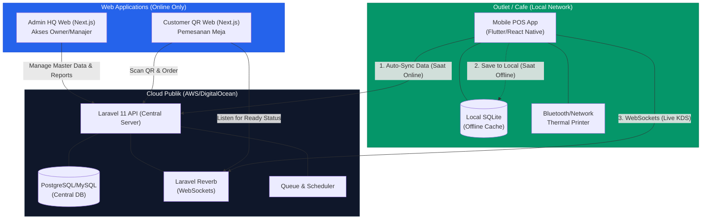

# Cafe-X Enterprise V2.0: Cloud & Mobile POS Architecture

Dokumen ini memuat rancangan arsitektur untuk pengembangan **Cafe-X V2.0**, di mana sistem dikonversi menjadi layanan berbasis *Cloud Publik* dengan aplikasi Kasir (*Point of Sales*) berbasis **Mobile (Tablet/Android) yang memiliki fitur Offline-First**.

## 1. Arsitektur V2.0 (Offline-First Mobile POS)

## 2. Rincian Fitur Mobile POS (Aplikasi Kasir)
Aplikasi POS khusus untuk perangkat Tablet/Mobile (Android/iOS) ini difokuskan **hanya** pada operasional harian outlet dan transaksi.

### Fitur Utama POS:
1. **Offline-First Checkout**: 
   * Kemampuan membuat pesanan baru dan menerima pembayaran tunai meskipun internet mati total.
   * Transaksi akan disimpan di *SQLite* (Local DB).
2. **Auto-Sync Engine**:
   * Sebuah *background service* di aplikasi yang akan mendeteksi koneksi internet. Jika aktif, aplikasi akan melempar semua data transaksi *offline* ke server Cloud secara *bulk* (massal).
3. **Cash Register & Shift**:
   * Buka kasir (*Open Register*) dengan saldo awal.
   * Tutup kasir (*Close Register*) dengan laporan rekonsiliasi kas (expected vs actual cash).
4. **Hardware Integration**:
   * Mencetak struk via *Bluetooth Thermal Printer* (tanpa butuh jaringan lokal).
   * Otomatis membuka laci kasir (*Cash Drawer*).
5. **Kitchen Display System (KDS) Terpadu**:
   * Mode *split-screen* atau tab khusus KDS di dalam satu aplikasi jika kafe menggunakan satu tablet yang sama, atau mode KDS murni di tablet terpisah yang disinkronkan via WiFi Lokal / WebSockets.
6. **QR Order Notification**:
   * Menerima notifikasi *real-time* saat ada pelanggan yang memesan via QR Code Web (Saat internet aktif).

## 3. Rincian Fitur HQ Web Dashboard (Next.js)
Aplikasi Admin yang sudah dibuat pada V1.0 akan berevolusi menjadi portal khusus manajemen level atas.
* **Global Inventory**: Memantau stok dari seluruh cabang outlet di satu layar.
* **Procurement**: Mengirim PO ke supplier untuk suplai barang ke berbagai cabang.
* **Master Menu**: Merubah harga atau menambah menu baru yang akan otomatis di-*download* (sync) oleh seluruh aplikasi Mobile POS di cabang.
* **Consolidated Reports**: Analisa penjualan, pajak, dan performa karyawan lintas cabang.
