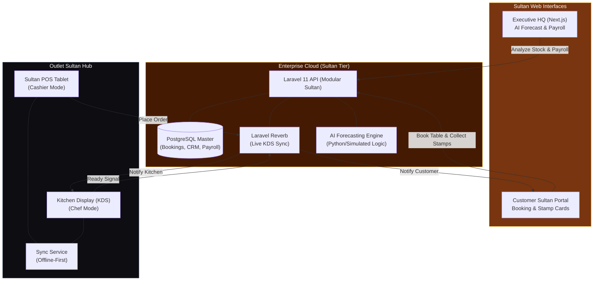

# Cafe-X Enterprise V3.0: Sultan Expansion Architecture

Dokumen ini memuat rancangan arsitektur untuk pengembangan **Cafe-X V3.0 (Sultan Expansion)**, yang meningkatkan platform dari sekadar POS menjadi ekosistem *Enterprise* lengkap dengan integrasi AI, Gamifikasi, dan Sistem Operasional Dapur tingkat lanjut.

## 1. Arsitektur Sultan (Enterprise Ecosystem)

## 2. Rincian Modul Sultan (V3.0)

### A. Kitchen Display System (KDS)
* **Real-time Synchronization**: Menggunakan Laravel Reverb (WebSockets) untuk sinkronisasi instan antara Kasir, Dapur, dan Pelanggan.
* **Order Orchestration**: Transisi status pesanan (*Preparing* ➔ *Cooking* ➔ *Ready*) yang memicu notifikasi push ke portal pelanggan.

### B. AI Inventory Forecasting
* **Sales Trend Analysis**: Menganalisis data penjualan 12 bulan terakhir untuk memprediksi kebutuhan stok 7 hari ke depan.
* **Smart Reordering**: Mendeteksi potensi *shortage* (kekurangan stok) dan memicu alur *Auto-Reorder* ke supplier yang terhubung.

### C. Digital Loyalty Gamification
* **Stamp Card System**: Mekanisme digital "Buy 9 Get 1 Free" yang otomatis terekam di setiap transaksi.
* **AI Retention Insights**: Memberikan rekomendasi promo khusus kepada member yang berisiko *churn* (berhenti berkunjung).

### D. Automated Payroll & Sultan Commissions
* **Performance-Based Pay**: Perhitungan gaji otomatis yang menggabungkan kehadiran (absensi) dengan insentif penjualan (komisi *upselling* menu premium).

## 3. Design System (Sultan Premium)
Sistem visual V3.0 telah dirombak menggunakan **Cafe-X Sultan Design System**:
* **Palette**: Coffee Brown (`#78350F`), Warm Gold (`#FBBF24`), Creamy BG (`#FEF3C7`).
* **Typography**: `Playfair Display SC` untuk kesan mewah dan `Karla` untuk kejelasan fungsional.
* **Principles**: OLED Dark Mode untuk efisiensi operasional dan Glassmorphism untuk portal pelanggan.

---
**Status**: V3.0 Sultan Expansion Fully Deployed.
