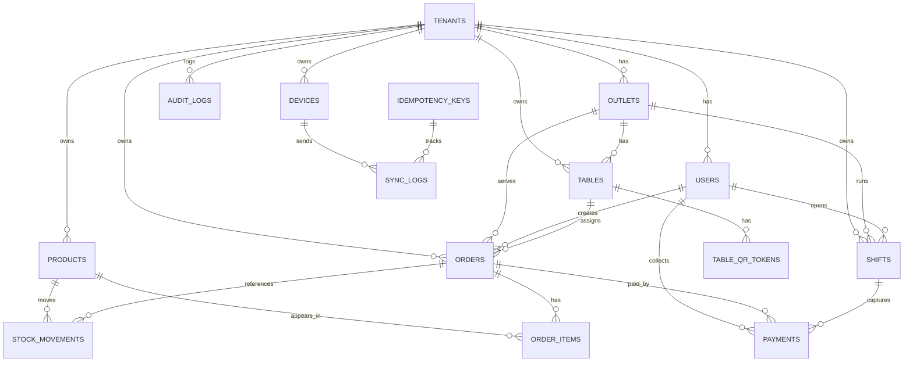

# Cafe-X POS ERD (Production Target)

## Overview
Core principles:
1. `tenant_id` on all business tables.
2. Immutable ledger-style movements (`stock_movements`, `audit_logs`).
3. Transactional writes on order/payment/cancel flow.

## Mermaid ERD

## Table List and Purpose
1. `tenants`
- SaaS tenant/company boundary.

2. `outlets`
- Branch/store per tenant.

3. `users`
- Staff identities with role assignment.

4. `roles`, `permissions`, `user_roles`, `role_permissions`
- RBAC model (`owner/admin/kasir/kitchen`).

5. `products`, `product_categories`
- Catalog/menu and grouping.

6. `product_prices`
- Future-proof for price history or schedule.

7. `tables`, `table_qr_tokens`
- Physical table mapping and QR token lifecycle.

8. `orders`
- Main order header with status, totals, source.

9. `order_items`
- Line items with snapshot data (`name_snapshot`, `unit_price`).

10. `payments`
- Settlement records and method breakdown.

11. `shifts`
- Cashier open/close process and variance.

12. `stock_movements`
- Inventory ledger (sale, cancel_restore, adjustment, initial).

13. `devices`
- POS device registration for sync tracking.

14. `sync_logs`
- Push/pull event observability by device.

15. `idempotency_keys`
- Safe retry for critical write APIs.

16. `audit_logs`
- Compliance trace for sensitive actions.

## Key Constraints
1. `orders.status` in:
- `new`, `preparing`, `ready`, `served`, `paid`, `canceled`

2. `payments.method` in:
- `cash`, `qris`, `transfer`, `card`, `other`

3. Uniqueness:
- `orders(order_no, tenant_id)`
- `tables(table_code, outlet_id)`
- `table_qr_tokens(token)` unique globally
- `idempotency_keys(key_hash)` unique

4. FK strategy:
- Hard FK for core transactional integrity.
- `ON DELETE RESTRICT` for records affecting financial trace.

## Indexing Strategy
1. Hot write/read indexes:
- `orders(tenant_id, outlet_id, business_date, status)`
- `order_items(order_id)`
- `payments(order_id, paid_at)`
- `stock_movements(product_id, created_at)`
- `sync_logs(device_id, created_at)`

2. Search/report indexes:
- `products(tenant_id, name)`
- `tables(outlet_id, table_code)`
- `shifts(outlet_id, shift_date, status)`

## State Rules
1. `paid` and `canceled` are terminal.
2. `order_items` cannot be edited after `paid`.
3. Cancel restores stock and writes compensating stock movement.
4. `shifts` close operation requires open shift by same cashier unless owner override.

